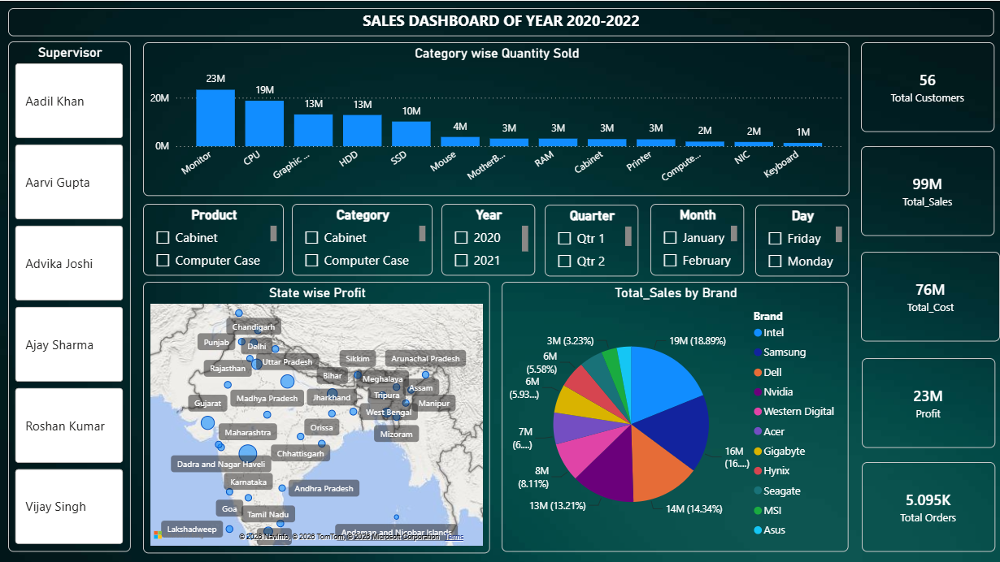

<!DOCTYPE html>
<html>
<head>

</head>
<body>

  

The dashboard shows sales performance from <b>2020–2022</b>, with <b>99M total sales</b>, <b>76M total cost</b>, and <b>23M profit from 5.095K orders</b> and <b>56 customers</b>.

The highest quantity sold is for <b>Monitors (23M)</b>, followed by <b>CPU (19M</b>) and <b>Graphic Card/HDD (13M each)</b>.

Brand-wise, Intel has the highest sales contribution with <b>19M</b>, followed by <b>Samsung (16M)</b> and <b>Dell (14M)</b>.

State-wise profit is visualized across India, showing that profit is distributed across multiple regions with different sales intensities.

</body>
</html>  

