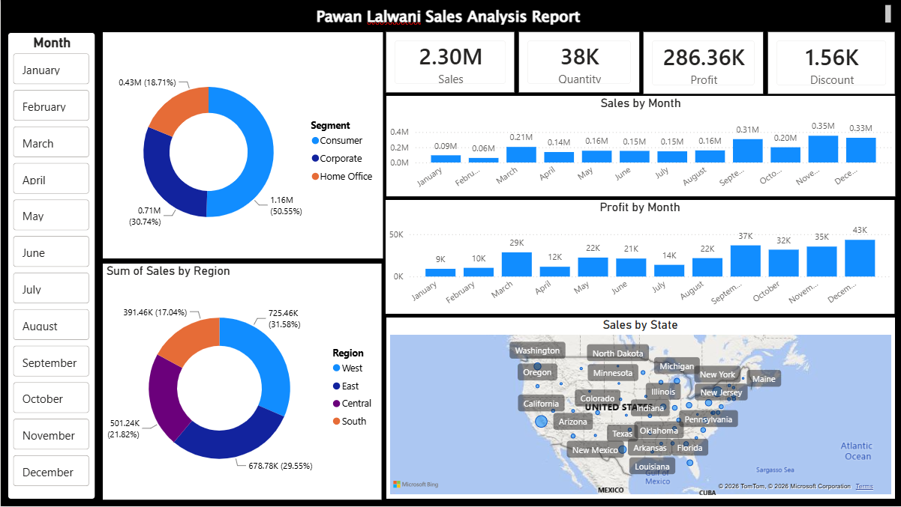

<!DOCTYPE html>
<html>
<head>

</head>
<body>

  

I created another interactive Power BI dashboard to analyze sales performance across different business dimensions.

This dashboard provides a clear overview of key KPIs, including total sales, quantity, profit, and discount. It also shows sales and profit trends by month, sales distribution by customer segment, regional sales performance, and state-wise sales using a map visualization.

Through this project, I practiced dashboard design, KPI reporting, slicers, map visualization, and storytelling with business data in Power BI.

</body>
</html>  

