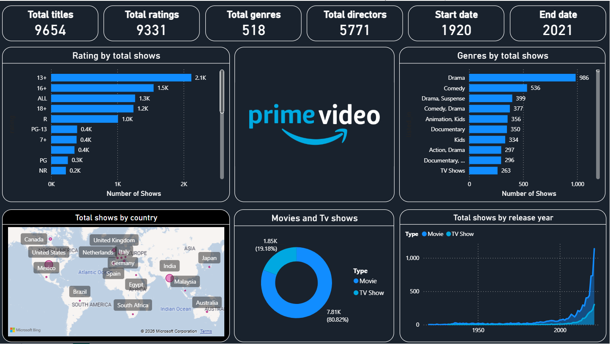

<!DOCTYPE html>
<html>
<head>

</head>
<body>

<h2>Amazon Prime Video Analytics Dashboard</h2>

  

  I recently developed an interactive <strong>Amazon Prime Video Analytics Dashboard</strong>
  using Power BI.

  The goal of this project was not only to visualize data, but also to transform a large
  content dataset into clear and meaningful insights for decision-making.

<h3>Dashboard Analysis</h3>

<ul>
  <li>9,654 titles across movies and TV shows</li>
  <li>Content distribution by genre, rating, country, and release year</li>
  <li>The proportion of movies compared with TV shows</li>
  <li>Historical content growth and release trends</li>
  <li>Key performance indicators such as total genres, directors, and ratings</li>
</ul>

<h3>Skills Demonstrated</h3>

  While working on this project, I strengthened my practical skills in
  <strong>data cleaning, data modelling, DAX, KPI development, dashboard design,</strong>
  and <strong>data storytelling</strong>.

  This project demonstrates my ability to convert raw data into an interactive and
  easy-to-understand business report—an important skill for
  <strong>Data Analyst</strong> and <strong>Business Intelligence</strong> roles.

</body>
</html>  

